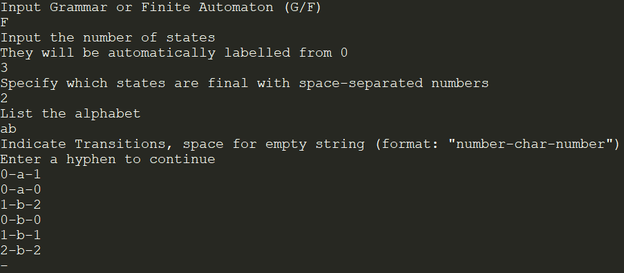
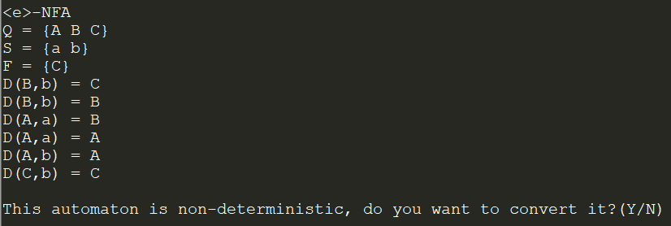

# Determinism in Finite Automata. Conversion from NDFA 2 DFA. Chomsky Hierarchy.

### Course: Formal Languages & Finite Automata

### Author: Otgon Dorin

## Theory

**Chomsky Hierarchy** - A hierarchy of classes of formal grammars named after the scientist Noam Chomsky. The hierarchy is composed of 4 types of formal grammars, lower levels including the higher ones:  
&emsp;***Type 0*** - Unrestricted grammar: Only 1 restriction on the production rules of this grammar: no empty string on the left side of the production.  
&emsp;***Type 1*** - Context-Sensitive grammar: The production rules of this grammar must all follow the format `xAy = xby`, where `x`,`y` are a string of any terminals or non-terminals, `b` is at least 1 terminal or non-terminal character, and `A` is a non-terminal character. `x` and `y` are called the "context" of `A`. If a non-terminal character has a transition to the empty string, it may not be on the left side of any other transition.  
&emsp;***Type 2*** - Context-Free grammar: Very similar to Type 1 grammars, as the main difference is that `x` and `y` (the "context") is no longer included: they are alawys empty strings. Production rules follow the format `A->b`, where `A` is a non-terminal and `b` can be the empty string or a string of terminal and/or non-terminals.  
&emsp;***Type 3*** - Regular grammar: The lowest in the hierarchy, it is the most restrictive type of gramamr, where all production rules must either have the format `A->Bb`(or `A->bB`, but never both) or `A->b`, where `B` is a single non-terminal and `b` is a single terminal character. Rules of the format `A->B` and `A-><empty string>` are allowed if there are rules of the prior format existent.  
&emsp;Type 3 grammars can be classfied into 2 types: "Left-regular" and "Right-regular", depending on the side the nonterminal character relative to the terminal one within the production rule. Type 3 grammars can be converted into Finite Automata and vice versa.

&emsp;**Deterministic Finite Automata** - Finite Automata where every transition may be uniquely determined by the input character and the next state. Cannot contain transitions with the empty string as input.  
&emsp;**Non-deterministic Finite Automata** - Finite Automata where there are multiple transition with the same input characters corresponding to the same state.

## Objectives

* Understanding the differences between different language types and finite automata
* Improve the code from the previous lab work - flesh out the Finite Automaton and determine where the user's grammar fits on the hierarchy
* Implement a way to freely convert from Type 3 grammar to finite automaton and vice versa
* Illustrate the automaton graphically

## Implementation Description
All the functionality of Lab 1 has been preserved, even after several modifications to the original code.  
Each objective has been completed, starting with the Grammar type determination. It has been achieved though excessive use of conditionals:
```cpp
//In Grammar:

int type = -1;
[...]
//"Type 4" grammar = right-regular grammar
//"Type 3" grammar = left-regular grammar
//"Type -1" stands for "Undetermined grammar. If -1 is outputted by this function, case was not covered.
void determine_type(){
	//Assess type of grammar according to input rule
	vector<char> e_set;
	for(auto x:prod_rules){
		string left = x.first;
		for(int i=0;i<x.second.size();i++){
			string right = x.second[i];
			if(type!=0){
				if(type!=1){
					if(type!=2){
						if(type==-1){
							if(left.size()>1){
								type = 0;
							}else if(right.size()>1){
								if('A'<=right[0] && right[0]<='Z'){
									type = 3;
								}else{
									type = 4;
								}
							}else{
								type = -1;
							}
						}
						
						if(right.size()>2){
							type = 2;
						}else if(right.size()==2){						
							if(type == 3 && (('A'<=right[1] && right[1]<='Z') || (right[0]<'A' || 'Z'<right[0]))){
								type = 2;
							}
							if(type == 4 && (('A'<=right[0] && right[0]<='Z') || (right[1]<'A' || 'Z'<right[1]))){
								type = 2;
							}
						}
					}
					
					if(left.size()>1){
						type = 1;
					}
				}
				
				if(left.size()>right.size() && right.size()>0){
					type = 0;
				}
				
				if(left.size()>1){
					int i=0, j=0, k=0;
					while(left[i] == right[j] && i<left.size() && j<right.size()){
						i++;
						j++;
					}
					if(i != left.size()){
						k=i;
						i = left.size()-1; j = right.size()-1;
						while(left[i] == right[j] && i>0 && j>0){
							i--;
							j--;
						}
						if(i > k){
							type = 0;
						}else{
							type = 1;
						}
					}
				}
			
				if(right.size() == 0){
					if(left.size()>1){
						type = 0;
					}else{
						e_set.push_back(left[0]);
					}
				}
			}
		}
	}
	
	//Check if any transition includes a non-terminal with a trnsition to empty string
	//i.e. S->A; A->;
	for(int i=0;i<e_set.size() && type!=0;i++){
		for(auto x:prod_rules){
			for(int j=0;j<x.second.size() && type!=0;j++){
				string right = x.second[j];
				for(int k=0;k<right.size();k++){
					if(right[k] == e_set[i]){
						type = 0;
						break;
					}
				}
			}
			if(type == 0){
				break;
			}
		}
	}
	
	//Only remaining cases are grammars where all rules are of type A->B, A->b or A->
	if(type == -1){
		type = 2;
	}
}
```
&emsp;In the above code, despite it looking complicated, all we are doing is checking each production rule of the grammar one by one, changing our assumption on what type the grammar fits in.  
&emsp;At the start, we use the value -1 to state that the grammar type is undetermined. Afterwards, following the rules stated in the Theory, we check if the grammar fits the current type or if it belongs in a lower type. So, for example, a grammar that we have said might belong to type 2 is checked if it belongs to type 0 or 1 with each subseqent rule.  
&emsp;We also check if there are any non-terminals on the right of any production that have a transition to an empty string. If such exists, the grammar automatically becomes a type 0 one, as type 1 grammars and its subsets may not have such production rules.  
&emsp;At the very end, the only types of grammars that remain undetermined are the ones with all rules respecting the format `A->b`, `A->B` and `A-><empty string>` without breaking the aforementioned exception. These are assumed to be Type 2 for simplicity, as they are neither left, nor right-regular grammars. 

&emsp;With the classification condition satisfied, we now focus on the Finite Automaton class, which has received a serious upgrade.  
&emsp;States and transitions can be directly inputted by the user, albeit limited at 26 states, as all states are labelled using capital letters, analogous to the Grammars. Removing this limitation is a priority for future work.  
&emsp;The Finite Automaton can now be converted to an equivalent Type 3 right-oriented grammar, no matter what transitions and states have been included. This was done by simply retrieving the data from the Finite Automaton in a way that the Grammar class constructor is able to use (to avoid circular dependency):
```cpp
//In FiniteAutomaton:

vector<char> get_states(){
	return states;
}

vector<char> get_alphabet(){
	return alphabet;
}

unordered_map<string, vector<string>> get_Grammar_productions(){
	unordered_map<string, vector<string>> P;
	for(auto x:transition){
		string left;
		left = x.first;
		vector<pair<char,char>> right = x.second;
		for(int i=0;i<right.size();i++){
			string temp;
			if(right[i].first!=' '){
				temp+=right[i].first;
			}
			if(right[i].second!=' '){
				temp+=right[i].second;
			}
			P[left].push_back(temp);
		}
	}
	return P;
};

//In main.cpp

Grammar* G = new Grammar(F->get_states(), F->get_alphabet(), F->get_Grammar_productions());
```

The Finite Automaton's determinism is checked after its construction simply by checking all the transitions for empty input strings and repeating ones:
```cpp
//In FiniteAutomaton

int determinism = 1;
[...]

//Determinism = 1 -> DFA
//Determinism = 0 -> NFA
//Determinism = -1 -> E-NFA
void check_determinism(){
	for(auto x:transition){
		vector<pair<char,char>> y = x.second;
		vector<char> temp;
		for(int i=0;i<y.size();i++){
			if(y[i].first == ' '){
				determinism = -1;
				break;
			}
			
			if(determinism == 1){
				for(int j=0;j<temp.size();j++){
					if(y[i].second == temp[j]){
						determinism = 0;
						break;
					}
				}
			}
			
			temp.push_back(y[i].second);
		}
		if(determinism == -1){
			break;
		}
	}
}
```

&emsp;The last objecctive was implementing a function to convert from NFA to DFA. In this lab work, the method implemented allows for conversions of E-NFAs to DFAs directly, even in situations involving loops of transitions with the empty string.  
&emsp;First and foremost, we find out all epsilon-closures of every state in the NFA using Depth First Search:
```cpp
//In FiniteAutomaton

void DFS(char curr_state, vector<int>* visited, unordered_map<char,vector<char>>* e_closure){
	vector<pair<char,char>> connections = transition[curr_state];
	(*visited)[curr_state-'A'] = 1;
	for(int i=0;i<connections.size();i++){
		char next_state = connections[i].second;
		if((*visited)[next_state-'A']==0 && connections[i].first == ' ' && next_state!=' '){
			DFS(next_state,visited,e_closure);
		}
	}
}

//In NFA_to_DFA(), in FiniteAutomaton

unordered_map<char,vector<char>> e_closure;
for(int i=0;i<states.size();i++){
	vector<int> temp(states.size(),0);
	DFS('A'+i,&temp,&e_closure);
	for(int j=0;j<temp.size();j++){
		if(temp[j] == 1){
			e_closure[i+'A'].push_back(j+'A');
		}
	}
}
```

&emsp;Afterwards, we create a state table where we keep track of each new state that will later be part of our DFA. We start with the epsilon-closure of the first element, which is the starting state of our FA by default. Any new states will be added to the table as the function runs. Due to the previous limitation of 26 maximum states, the conversion will end early with an error if the number of states exceeds that. Otherwise, the data of the current Finite Automaton will be replaced with the DFA equivalent.
```cpp
//in FiniteAutomaton

vector<vector<vector<char>>> state_table;
[...]
int row=0;
while(state_table.size()<=26 && row!=state_table.size()){
	for(int j=0;j<alphabet.size();j++){
		//Find all states reachable through a character, followed by eps-transitions
		vector<char> pending_state;
		for(int k=0;k<state_table[row][0].size();k++){
			vector<pair<char,char>> connections = transition[state_table[row][0][k]];
			for(int x=0;x<connections.size();x++){
				if(connections[x].first == alphabet[j]){
					pending_state.insert(pending_state.end(),e_closure[connections[x].second].begin(),e_closure[connections[x].second].end());
				}
			}
		}
		
		//Clear the pending state of repeating elements
		vector<char> unique_states;
		int x=0;
		while(x<pending_state.size()){
			int erased = 0;
			for(int y=0;y<unique_states.size();y++){
				if(pending_state[x] == unique_states[y]){
					pending_state.erase(pending_state.begin()+x);
					erased = 1;
				}
			}
			if(!erased){
				unique_states.push_back(pending_state[x]);
				x++;
			}
		}
		
		//Sort the remaining characters
		sort(pending_state.begin(),pending_state.end());
		
		state_table[row][j+1] = pending_state;
		
		if(pending_state.size() > 0){
			//If the state set has been analysed before, don't add it
			int unique = 1;
			for(int i=0;i<=row;i++){
				if(state_table[i][0] == pending_state){
					unique = 0;
				}
			}
			
			//If the state is new, add it to the bottom of our table in a new row
			if(unique){
				vector<vector<char>> temp;
				temp.push_back(pending_state);
				for(int i=0;i<alphabet.size();i++){
					temp.push_back(vector<char>(0));
				}
				state_table.push_back(temp);
			}
		}
	}
	row++;
}
```

After constructing the state table, 

```cpp
//In FiniteAutomaton

//Map our new states to single characters
vector<vector<char>> new_state_arr;
for(int i=0;i<state_table.size();i++){
	new_state_arr.push_back(state_table[i][0]);
}

//Replace our final states
vector<char> temp;
char index;
for(int i=0;i<state_table.size();i++){
	int terminal = 0;
	for(int k=0;k<state_table[i][0].size() && terminal == 0;k++){
		for(int x=0;x<end_states.size();x++){
			if(state_table[i][0][k] == end_states[x]){
				index = i+'A';
				shift_char(&index);
				temp.push_back(index);
				terminal = 1;
				break;
			}
		}
	}
}
end_states = temp;

states.clear();
transition.clear();

//Replace the states and transitions accordingly.
for(int i=0;i<state_table.size();i++){
	for(int j=0;j<alphabet.size();j++){
		if(state_table[i][j+1].size()>0){
			pair<char,char> temp;
			temp.first = alphabet[j];
			for(int k=0;k<new_state_arr.size();k++){
				if(state_table[i][j+1] == new_state_arr[k]){
					index = k+'A';
					shift_char(&index);
					temp.second = index;
					break;
				}
			}
			index = i+'A';
			shift_char(&index);
			transition[index].push_back(temp);
		}
	}
	index = i+'A';
	shift_char(&index);
	states.push_back(index);
}
```

&emsp;With all the requirements met, a graphical representation of the finite automaton has been implemented using the Python version of Graphviz. An implementation using it as a C library was attempted but ultimately failed. Screenshots have been provided in the next section.

## Results
&emsp;The program was made to accept user input and provides instructions on how it must be formatted for smooth execution.
Giving the program the finite automaton definition of Variant 19...  


&emsp;The finite automaton, confirmed to be non-deterministic, is converted and displayed in text form:  


&emsp;Afterwards, the program convers the DFA into a Grammar. This is possible directly from the NFA as well:  


&emsp;The Finite Automaton is then displayed to the user, if so is chosen. Several screenshots of NFAs and their DFA equivalents are provided below, the first being Variant #19 given by the lab conditions. Finite Automatons always have their starting state denoted by the letter 'S'.

First FA:  
  
  
Second FA:  
  
  
Third FA:  
  
  

&emsp;The results can be proof-checked to be correct using other software or pen and paper given a fair amount of spare time.

## Conclusion
&emsp;Over the course of this laboratory work, a functioning implementation of the mathematical model of the newly learned concepts of a grammar and a finite automaton have been successfully made and tested, providing useful results and serving as a basis for developing more advanced algorithms based on the aforementioned concepts.

## References
Johnson, M., & Zelenski, J. (2012, June 29). Formal Grammars. Retrieved February 17, 2023, from https://web.stanford.edu/class/archive/cs/cs143/cs143.1128/handouts/080%20Formal%20Grammars.pdf
University of Pennsylvania - Penn Engineering (2019, Spring). DFA's, NFA's, Regular Languages. Retrieved March 7, 2023, from https://www.seas.upenn.edu/~cis2620/notes/cis262sl1-aut.pdf
